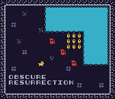
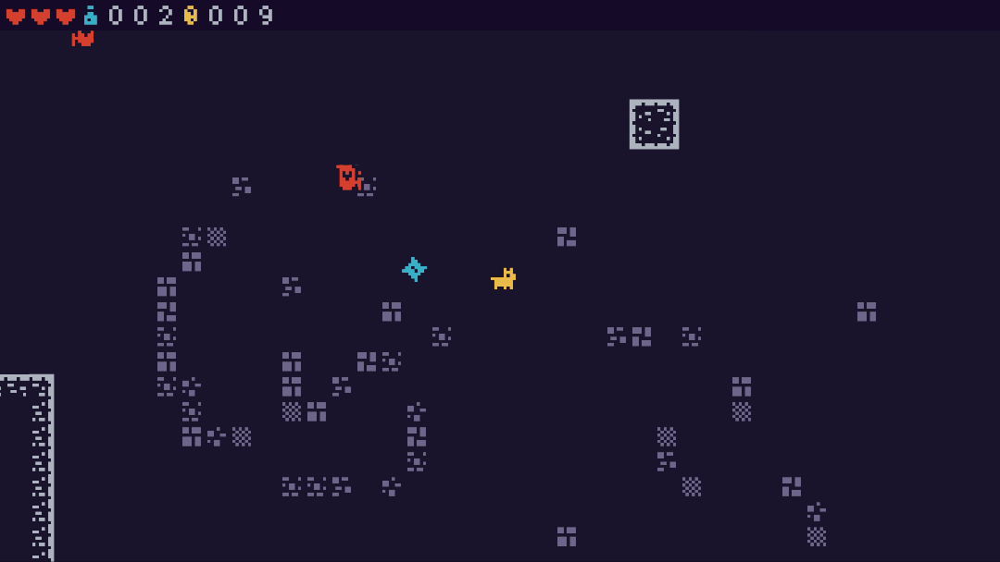
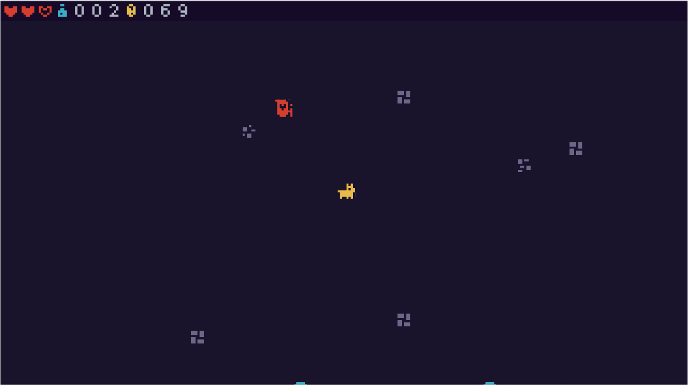

# Obscure Resurrection

## Overview

This is a game made in Bevy 0.6 to test things out and have fun.

Run around as Dog. Collect coins and stay alive.

You can view the game on Itch [here](https://dustyplant.itch.io/obscure-resurrection).





## Run the Game

### In Development For Fast Iterations

```bash
cargo run --features bevy/dynamic
```

### In Release Mode

```bash
cargo run --release
```

## Build the Game

### Natively

```bash
cargo build --release
```

### For the Web

To build for the web make sure you have wasm-bindgen-cli installed. You can do so with the following command.

```bash
cargo install -f wasm-bindgen-cli
```

Make sure that you have the WASM target added.

```bash
 rustup target install wasm32-unknown-unknown
 ```

Run the following command to build the assets.

```bash
./build-web-zip.sh
```

You can upload the `dist/dist.zip` file to Itch.io or any web server.

You can easily test this locally by starting a simple http server with the following command and see it at http://localhost:3000

```bash
python -m http.server --directory dist 3000
```

